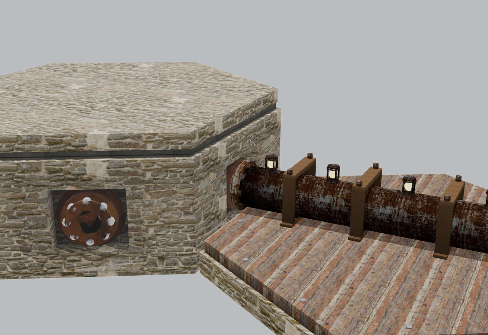

# Models

Modelle, erstellt mit Claude — für ein Hex-Grid-Strategiespiel im Browser. Stylized Low-Poly+, alle Modelle für Three.js optimiert (jedes GLB unter 500 KB, AO ins Vertex-Color gebacken, Draco-komprimiert).



*Zwei angrenzende Hex-Tiles: links die Building-Foundation (base_plate), rechts ein gerades Rohr-Segment auf der Rohr-Foundation (pipe_plate). Pipe-W-Flansch und base_plate-E-Recess treffen sich exakt am gemeinsamen Hex-Edge.*

---

## Aktueller Stand

| Asset | GLB | Polys | Beschreibung |
|---|---:|---:|---|
| [base_plate](base_plate/) | 376 KB | 1084 | Stein-Foundation für Gebäude (Hex, 0.72 hoch), 6 Pipe-Anschlüsse mit eingelassenen Flanschen |
| [base_plate/deko/planks](base_plate/deko/) | 65 KB | 136 | 2 verwitterte Holzbretter (Deko, optional) |
| [base_plate/deko/lamp](base_plate/deko/) | 323 KB | 8321 | PolyHaven-Holzlaterne (Deko, optional) |
| [pipe_plate](pipe_plate/) | 126 KB | 168 | Niedrige Foundation für Rohre (0.19 hoch), Holzbretter-Deck mit Nägeln |
| [pipes/pipe_straight](pipes/) | 162 KB | 1750 | Gerades Rohr E↔W mit 5 Lampen + 4 Holz-Brackets |
| [pipes/pipe_curve_gentle](pipes/) | 174 KB | 1614 | 60°-Bogen E↔NW (Radius 1.5), eine Kante übersprungen |
| [pipes/pipe_curve_sharp](pipes/) | 177 KB | 1614 | 120°-Bogen E↔NE (Radius 0.5), benachbarte Kanten |
| [buildings/harvester](buildings/harvester/) | 118 KB | 416 | Erstes Gebäude — Wind-Pump-Style mit 8 Holzblättern, gelbem Hub, sitzt auf base_plate. `anim_spin_x` für Three.js Rotor-Animation |

**Insgesamt aktuell: ~1.5 MB für die fertigen Assets** — web-tauglich für eine Insel mit hunderten Hexes.

Mit den 3 Pipe-Modellen (straight, curve_gentle, curve_sharp) plus Y-Rotation in Three.js sind **alle 15 möglichen Hex-Edge-Verbindungen** abgedeckt:
- straight: 3 Pairs (gegenüberliegende Kanten)
- curve_gentle: 6 Pairs (eine Kante übersprungen)
- curve_sharp: 6 Pairs (benachbarte Kanten)

---

## Hex-Grid-Konventionen

- **Pointy-top Hex**, Hex-Radius `HEX_R = 1.0`, Apothem `≈ 0.866`
- **Edge-Index:** 0=East (0°), 1=NE (60°), 2=NW (120°), 3=West (180°), 4=SW (240°), 5=SE (300°)
- **Anchor-Empties** (`anchor_0..5`) liegen an Edge-Mitten auf `z=0.30` — Three.js nutzt sie als Snap-Punkte
- **Pipe-Centerline universell auf z=0.30**, Pipe-Außenradius 0.11
- **pipe_plate-Top auf z=0.19** → Pipe-Bottom passt nahtlos auf das Wood-Deck
- **Flansch-Maße** identisch auf base_plate und pipe_straight: Disc r=0.135 d=0.04, 8 Bolts (r=0.020, d=0.040, Orbit-Radius 0.10) → Bolt-Reihen aus Nachbar-Hex greifen ineinander am Apothem

---

## Pipeline (für jedes neue Asset)

1. **PolyHaven-Asset** importieren (Diffuse-Maps reichen — wir rendern flat-shaded ohne PBR)
2. **PBR-Maps strippen**: nur Diffuse behalten, Normal/Rough/Metal/Displacement entfernen
3. **Texturen runterskalieren** auf 512×512
4. **UV cube_project** (Cube-Size je nach Mesh-Größe, typisch 0.15–0.30)
5. **AO-Bake** in Cycles (samples=32, distance=0.4–0.6) → Vertex-Color-Attribute `Col`
6. **Material-Setup** (Blender 5.1 modern):
   ```
   Image Texture → ShaderNodeMix (RGBA, MULTIPLY) → BSDF Base Color
                       ↑
              ShaderNodeVertexColor("Col")
   ```
7. **Mesh-Joining**: viele kleine Teile (Bolts, Bands) zu einzelnen Meshes joinen für weniger Draw-Calls
8. **Export** glTF Binary mit:
   ```python
   bpy.ops.export_scene.gltf(
       export_format='GLB',
       export_apply=True,
       export_yup=True,
       export_image_format='JPEG',
       export_jpeg_quality=80,
       export_draco_mesh_compression_enable=True,
       export_draco_mesh_compression_level=6,
   )
   ```

→ Typische Größen: 50–400 KB pro Modell.

Alle Details + Stolperfallen (Blender 5.1-Spezifika, Cycles-vor-Bake-Pflicht, Cylinder-Subdivisions für AO) stehen in **[PROJECT_STATE.md](PROJECT_STATE.md)**.

---

## Three.js-Nutzung

```js
import { GLTFLoader } from 'three/examples/jsm/loaders/GLTFLoader.js';
import { DRACOLoader } from 'three/examples/jsm/loaders/DRACOLoader.js';

const dracoLoader = new DRACOLoader();
dracoLoader.setDecoderPath('/draco/');  // include Draco decoder
const gltfLoader = new GLTFLoader().setDRACOLoader(dracoLoader);

// Beispiel: Pipe + Plate an einer Hex-Position laden
const hexGroup = new THREE.Group();
hexGroup.position.set(hexX, 0, hexZ);
hexGroup.rotation.y = Math.PI / 3 * edgeIndex;  // 0/60/120° für E↔W / NE↔SW / NW↔SE

const plate = await gltfLoader.loadAsync('pipe_plate/pipe_plate.glb');
const pipe = await gltfLoader.loadAsync('pipes/pipe_straight.glb');
hexGroup.add(plate.scene, pipe.scene);
scene.add(hexGroup);

// Flow-Indikator: pulsiere die 5 Pipe-Lampen
const bulbs = [0,1,2,3,4].map(i => pipe.scene.getObjectByName(`PS_Lamp${i}_bulb`));
function tick(t) {
  bulbs.forEach((b, i) => {
    const phase = ((t/300 + i*0.2) % 1);
    const intensity = Math.max(0, 1 - 4*Math.abs(phase - 0.5)) * 2;
    b.material.emissiveIntensity = intensity;
  });
}
```

---

## Repo-Struktur

```
.
├── README.md                   ← du liest gerade
├── PROJECT_STATE.md            ← detaillierte Pipeline-Doku
├── LICENSE                     ← MIT (eigener Code/Modelle), PolyHaven-Texturen sind CC0
├── base_plate/
│   ├── plate/                  ← Building-Foundation
│   ├── deko/                   ← optionale Deko (Bretter, Laterne)
│   └── meta.json
├── pipe_plate/                 ← Rohr-Foundation
│   └── meta.json
└── pipes/
    ├── pipe_straight.glb       ← gerade Verbindung
    ├── connection_test.png     ← Showcase (oben im README)
    └── meta.json
```

Jedes Asset-Verzeichnis enthält:
- `*.glb` — das exportierte Modell
- `*.blend` — Blender-Quelle (zur Bearbeitung)
- `*_preview.png` — Beauty-Render
- `meta.json` — Spezifikationen, Anchor-Positionen, Material-Familien

---

## Credits

PolyHaven CC0-Assets ([polyhaven.com](https://polyhaven.com)):

**Texturen:**
- `castle_wall_slates` — Stein-Mauerwerk (base_plate, pipe_plate)
- `dark_planks` — Holz-Trim (base_plate)
- `worn_planks` — Holz-Deck (pipe_plate)
- `wood_planks_dirt` — Deko-Bretter, Pipe-Brackets
- `rusty_metal_04` — Pipe-Body, Flansche, Bänder, Lampen, Bolts
- `rusty_metal_grid` — frühe Pipe-Body-Iteration (in deko.blend noch sichtbar)
- `fine_grained_wood`, `wood_table_worn` — frühe Plank-Iterationen
- `rust_coarse_01` — frühe Flansch-Iterationen

**Modelle:**
- `wooden_lantern_01` — Deko-Laterne neben der base_plate
- `industrial_caged_sconce` — als Inspiration für die selbstgebauten Pipe-Lampen

---

## Lizenz

MIT — siehe [LICENSE](LICENSE).
